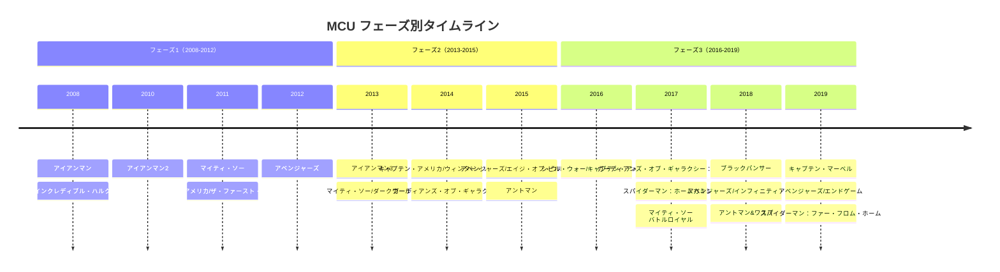
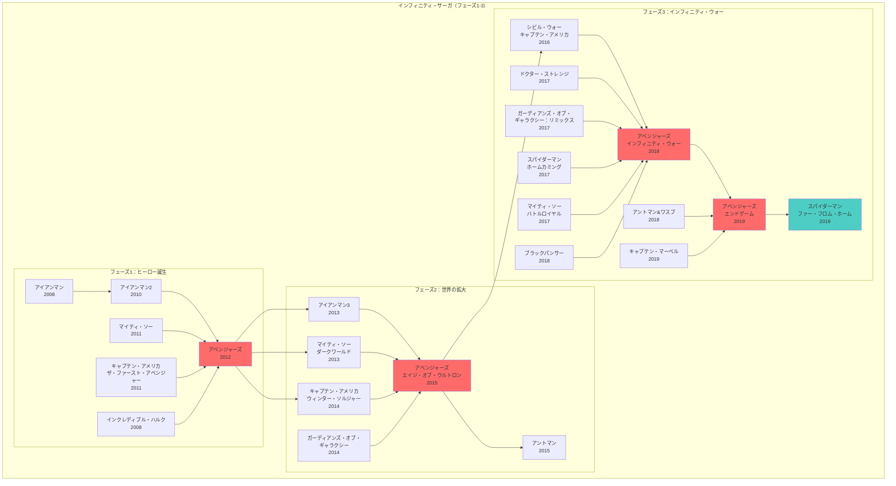
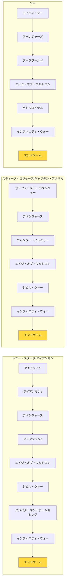
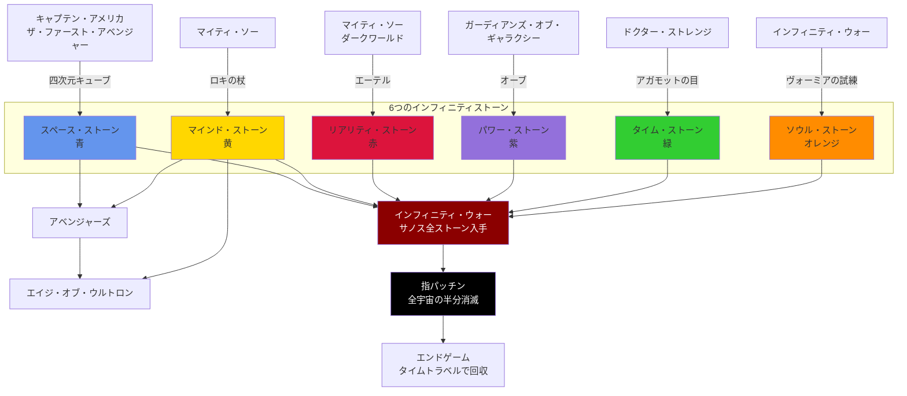

# MCU作品関係図

マーベル・シネマティック・ユニバース（MCU）の全作品の関係性を視覚的に示した資料です。

## 目次
- [フェーズ別タイムライン](#フェーズ別タイムライン)
- [インフィニティ・サーガの流れ](#インフィニティサーガの流れ)
- [主要キャラクター登場作品マップ](#主要キャラクター登場作品マップ)
- [インフィニティストーン登場作品](#インフィニティストーン登場作品)

---

## フェーズ別タイムライン

---

## インフィニティ・サーガの流れ

---

## 主要キャラクター登場作品マップ

---

## インフィニティストーン登場作品

MCUの核となる6つのインフィニティストーンと、それぞれが登場する作品の関係図です。

---

## フェーズごとの特徴

### フェーズ1：ヒーロー誕生（2008-2012）
**テーマ**: 個々のヒーローの誕生とアベンジャーズ結成

- 6作品で構成
- 各ヒーローのオリジンストーリー
- S.H.I.E.L.D.とニック・フューリーの登場
- クライマックス：『アベンジャーズ』でチーム結成

**重要要素**:
- アーク・リアクター技術
- 超人血清
- アスガルドとビフレスト
- テッセラクト（スペース・ストーン）

---

### フェーズ2：世界の拡大（2013-2015）
**テーマ**: 宇宙規模への拡大とインフィニティストーンの登場

- 6作品で構成
- S.H.I.E.L.D.の崩壊
- ガーディアンズ・オブ・ギャラクシー登場
- ヴィジョンの誕生
- インフィニティストーンの重要性が明らかに

**重要要素**:
- ヒドラの陰謀
- アントマンとピム粒子
- ウルトロンの脅威
- 宇宙規模の物語展開

---

### フェーズ3：インフィニティ・ウォー（2016-2019）
**テーマ**: サノスとの最終決戦、インフィニティ・サーガの完結

- 11作品で構成（最大規模）
- ヒーロー同士の内戦（シビル・ウォー）
- サノスの登場と指パッチン
- タイムトラベルによる逆転
- オリジナル・アベンジャーズの引退

**重要要素**:
- アベンジャーズの分裂と再結集
- 6つすべてのインフィニティストーン
- サノスとの2度の戦い
- トニー・スタークの犠牲

---

## 作品間の重要な繋がり

### アベンジャーズへの道
1. **アイアンマン** → アーク・リアクター技術、トニーのヒーロー化
2. **インクレディブル・ハルク** → ブルース・バナー登場
3. **アイアンマン2** → ブラック・ウィドウ初登場
4. **マイティ・ソー** → 神話の世界とロキ
5. **キャプテン・アメリカ** → スティーブの復活
6. **アベンジャーズ** → チーム結成

### ウィンター・ソルジャーの影響
- S.H.I.E.L.D.崩壊
- ヒドラの復活
- キャプテンとアイアンマンの不和の種
- 『シビル・ウォー』への伏線

### インフィニティ・ウォーへの収束
すべての作品がインフィニティストーンを通じて繋がり、『インフィニティ・ウォー』『エンドゲーム』で完結する壮大な物語構造。

---

## 視聴推奨順序

### 初心者向け（最小限）
1. アイアンマン
2. キャプテン・アメリカ/ザ・ファースト・アベンジャー
3. アベンジャーズ
4. キャプテン・アメリカ/ウィンター・ソルジャー
5. アベンジャーズ/エイジ・オブ・ウルトロン
6. シビル・ウォー/キャプテン・アメリカ
7. アベンジャーズ/インフィニティ・ウォー
8. アベンジャーズ/エンドゲーム

### 完全版
公開順に視聴することで、制作側が意図した体験ができます。

### 時系列順
物語内の時系列順で視聴したい場合：
1. キャプテン・アメリカ/ザ・ファースト・アベンジャー（1940年代）
2. キャプテン・マーベル（1995年）
3. アイアンマン（2008年）
4. 以降、ほぼ公開順

---

## MCUの今後

**フェーズ4-6**: マルチバース・サーガ
- 新世代ヒーローの台頭
- マルチバースの概念
- 新たな脅威カーン

MCUは進化を続け、新しい物語が展開されていきます。
